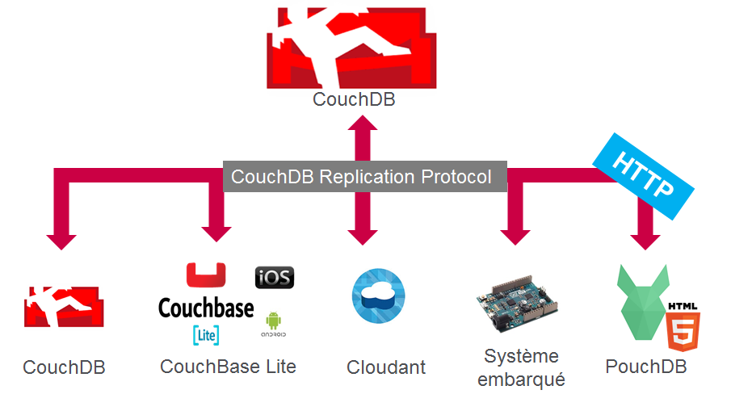

Synchronisation multi-client avec CouchDB et PouchDB
====================================================

Offline First
-------------

Aujourd'hui, alors que les usages nomades et mobiles explosent, il est devenu obligatoire de penser "Mobile First" mais
aussi "Offline First" lorsque l'on souhaite développer une nouvelle application.

Il est intéressant de mettre en parallèle les 2 approches :

- Mobile First : « Design for the smallest device first and then apply progressive enhancement techniques to take 
advantage of larger screen sizes »

- Offline First : « Design for offline usage first and then apply progressive enhancement techniques to take advantage of 
network connectivity when available »

Si cela peut sembler très simple "sur le papier", il en est autrement lorsque l'on souhaite implémenter et intégrer la 
gestion du mode Offline et la synchronisation de données à son application.

En effet, la synchronisation/réplication de données a toujours été un problème compliqué en informatique (intégrité, conflit, etc...) 
et l'utilisation conjointes des 2 technologies que je vais vous présenter dans cette article va nous aider à en réduire
considérablement la complexité.

CouchDB
-------
[CouchDB](http://couchdb.apache.org/) est une base de données NoSQL orientée document et open source, elle est développée et maintenue par
la fondation apache. Comme pour MongoDB, les documents sont stockés au format JSON, la similarité avec Mongo s'arrêtant là.
En effet, à la différence des autres systèmes de base de données NoSQL, CouchDB se démarque sur 2 points essentiels (et non des
moindres) :

- CouchDB expose ces API via REST, c'est à dire que tout est accessible via http. 
C'est pourquoi nous parlons de base de données qui embrasse le web ("database that embraces the web"). 
Pas besoin d'utiliser un pilote ou une librairie dans un langage cible.

- CouchDB c'est aussi un protocole de réplication bidirectionnelle master/master via http.
Tout système de base de données implémentant ce protocole est donc capable de se répliquer
vers et depuis un autre système implémentant également ce protocole.

> Pour les plus curieux, la spécification du protocole est disponible depuis ce lien : [http://docs.couchdb.org/en/1.6.1/replication/protocol.html](http://docs.couchdb.org/en/1.6.1/replication/protocol.html)

Le schéma ci-dessous montre les différentes possibilités :



Il est donc possible de synchroniser et répliquer 2 bases de données entre une application
mobile utilisant CouchBase Lite et un serveur Cloudant, les 2 systèmes implémentant 
le protocole CouchDB.

> A noter que Cloudant (IBM) et CouchBase sont 2 forks du code source de CouchDB.

Regardons à présent de plus près la technologie qui va nous permettre de rendre 
"Offline First" une application web : PouchDB. 

PouchDB
-------

[PouchDB](https://pouchdb.com/) est l'implémentation web (JavaScript) du protocole de réplication CouchDB.
(En exagérant, on pourrait même dire que Pouchdb est l'implémentation en JavaScript de CouchDB).

Ses principales caractéristiques sont :

- Cross Platform et Cross Browser (fonctionne dans tous les navigateurs et Node.js)
- Emule les API CouchDB
- Les données sont stockées localement (IndexedDB/Web SQL)
- API asynchrone (basé sur les [Promises](https://developer.mozilla.org/fr/docs/Web/JavaScript/Reference/Objets_globaux/Promise))
- Gère le mode Offline et la synchronisation avec CouchDB.

### Installation
Commençons par l'installation, plusieurs solutions s'offrent à vous. Je préfère l'utilisation
de [Bower](https://bower.io/) ou encore mieux de [npm](https://www.npmjs.com/), mais vous
pouvez aussi directement télécharger le fichier source minifié et l'intégrer à votre code
source.

#### Téléchargement direct
Téléchargez la dernière [version](https://github.com/pouchdb/pouchdb/releases/download/5.4.5/pouchdb-5.4.5.min.js)
puis insérez la ligne suivante dans votre `index.html` :
```html
<script src="pouchdb-5.4.5.min.js"></script>
```

#### Bower
Lancez la ligne de commande suivante
```sh
$ bower install pouchdb
```

puis insérez la ligne suivante dans votre `index.html` :
```html
<script src="bower_components/pouchdb/dist/pouchdb.min.js"></script>
```

#### npm
Lancez la ligne de commande suivante
```sh
$ npm install pouchdb
```

puis insérez la ligne suivante dans votre `index.html` :
```html
<script src="node_modules/pouchdb/dist/pouchdb.min.js"></script>
```

### Création d'une base de donnée locale
La première étape est la création d'une base de données locale :
```javascript
var db = new PouchDB("smart-meter");
console.log("Local database created");
```

PouchDB va créer une base de données locale en utilisant la technologie disponible du navigateur :
si IndexedDB est disponible (comme sur la plupart des navigateurs récent), il privilégiera 
cette technologie. Si celle-ci n'est pas disponible, il utilisera WebSQL (Safari).

### Ajout de document
Une fois notre base de données créée, nous pouvons commencer à insérer des documents :

```javascript
// Avec la fonction post
db.post({
  date: "2014-11-12T23:27:03.794Z",
  kilowatt_hours: 14
}).then(function() {
  console.log("Document created");
}).catch(function(error) {
    console.log(error);
});

// Avec la fonction put
db.put({
  _id: "2014-11-12T23:27:03.794Z",
  kilowatt_hours: 14
}).then(function() {
  console.log("Document created");
}).catch(function(error) {
    console.log(error);
});
```

> En utilisant la fonction `db.post()`, on laisse PouchDB générer automatiquement un identifiant
unique (`_id`). Alors qu'avec la fonction `db.put()`, il faut explicitement inclure une 
propriété `_id` au document.

### Modification d'un document
Modifier un document est aussi simple qu'ajouter un document, il suffit d'utiliser la fonction
`db.put()` :

```javascript
db.put({
  _id: "2014-11-12T23:27:03.794Z",
  kilowatt_hours: 14
}).then(function(response) {
  console.log("Document created");
  // Get the document
  return db.get(response.id);
}).then(function(doc) {
  console.log("Document read");
  // Update the value for kilowatt hours
  doc.kilowatt_hours = 15;
  // Put the document back to the database
  return db.put(doc);
}).catch(function(error) {
    console.log(error);
});
```